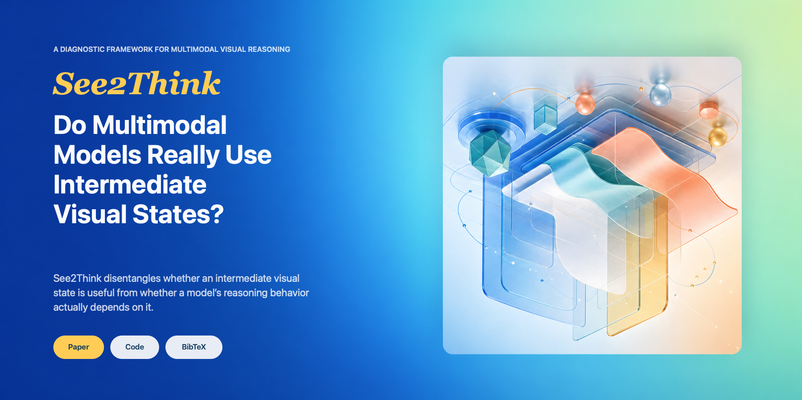
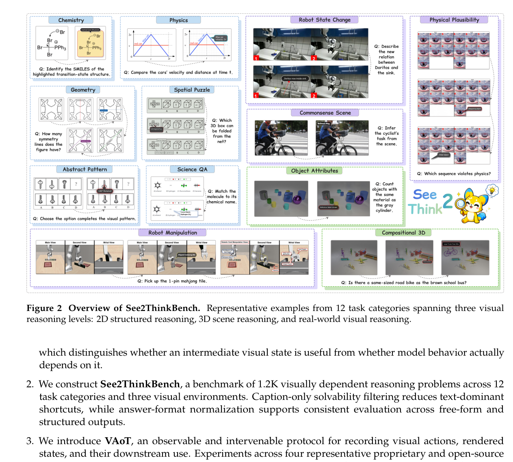
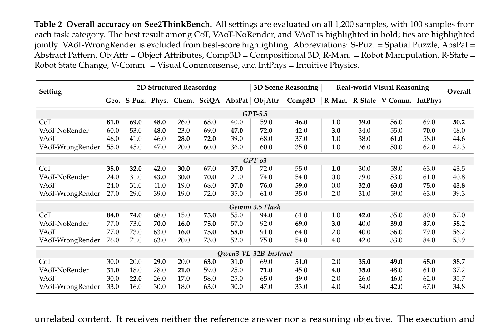
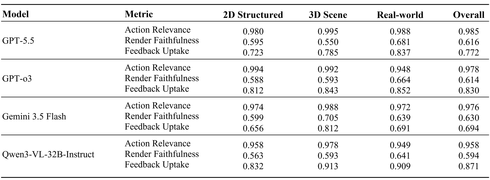

<p align="center">
  
</p>

<h1 align="center">See2Think</h1>

<p align="center">
  <strong>Do Multimodal Models Really Use Intermediate Visual States?</strong>
</p>

<p align="center">
  Siyu Yan<sup>1,3,†</sup>&nbsp;&nbsp;
  Zhuoran Yan<sup>2,†</sup>&nbsp;&nbsp;
  Haiying Xu<sup>3,4,†</sup>&nbsp;&nbsp;
  Panhao Zhou<sup>2</sup>&nbsp;&nbsp;
  Jingyu Chen<sup>2</sup>&nbsp;&nbsp;
  Chenhao Ji<sup>3</sup>&nbsp;&nbsp;
  Shuo Cao<sup>3,5</sup><br>
  Yongheng Zhang<sup>2</sup>&nbsp;&nbsp;
  Haoze Liu<sup>3</sup>&nbsp;&nbsp;
  Siyu Zhang<sup>3,6</sup>&nbsp;&nbsp;
  Xiwen Gu<sup>7</sup>&nbsp;&nbsp;
  Yihao Liu<sup>3</sup>&nbsp;&nbsp;
  Alex Jinpeng Wang<sup>2,§</sup>
</p>

<p align="center">
  <a href="https://sgysy.github.io/seetothink/"></a>
  <a href="https://github.com/CSU-JPG/See2Think"></a>
  
</p>

<p align="center">
  <a href="LICENSE"></a>
  
  <a href="https://github.com/CSU-JPG/See2Think/stargazers"></a>
</p>

<p align="center">
  <a href="#the-question">The Question</a> ·
  <a href="#see2thinkbench">Benchmark</a> ·
  <a href="#visual-action-of-thought">VAoT</a> ·
  <a href="#results">Results</a> ·
  <a href="#quick-start">Quick Start</a> ·
  <a href="#citation">Citation</a>
</p>

---

## The Question

> A model can produce a useful-looking intermediate image—but does its later reasoning actually depend on that visual state?

Multimodal models can draw auxiliary lines, crop regions, highlight objects, and request rendered intermediate images. Final-answer accuracy alone cannot reveal whether the model chose a relevant visual action, whether the renderer executed it faithfully, or whether the returned visual state affected subsequent reasoning.

**See2Think** turns this hidden process into something measurable.

<p align="center">
  
</p>

<p align="center">
  <sub><strong>Figure 1.</strong> From final-answer evaluation to controlled diagnosis of visual-state use.</sub>
</p>

<table>
  <tr>
    <td width="25%"><strong>01 · Benchmark</strong><br><sub>1,200 open-ended, visually dependent problems.</sub></td>
    <td width="25%"><strong>02 · Three visual worlds</strong><br><sub>2D structures, 3D scenes, and real-world reasoning.</sub></td>
    <td width="25%"><strong>03 · Process diagnosis</strong><br><sub>Measure action, rendering, and feedback separately.</sub></td>
    <td width="25%"><strong>04 · Intervention</strong><br><sub>Corrupt feedback to reveal behavioral dependence.</sub></td>
  </tr>
</table>

## See2ThinkBench

See2ThinkBench contains **1,200 samples across 12 task categories**. Every problem is open-ended and visually dependent, spanning three complementary reasoning worlds:

- **2D structured reasoning** — diagrams, charts, geometry, and symbolic visual structure.
- **3D scene reasoning** — spatial relations, embodied scenes, and manipulation.
- **Real-world visual reasoning** — natural images and grounded multimodal questions.

<p align="center">
  
</p>

<p align="center">
  <sub><strong>Figure 2.</strong> Representative See2ThinkBench examples across 12 task categories and three visual worlds.</sub>
</p>

## Visual Action-of-Thought

**Visual Action-of-Thought (VAoT)** records the complete reasoning trajectory: textual thought, visual action, rendered state, follow-up reasoning, and final answer.

<p align="center">
  
</p>

### Four matched inference settings

| Setting | Visual action | Rendered feedback | Diagnostic role |
| --- | :---: | :---: | --- |
| **CoT** | — | — | Text-only reasoning baseline |
| **VAoT-NoRender** | ✓ | — | Is proposing an action alone useful? |
| **VAoT-Full** | ✓ | ✓ | Does genuine visual feedback help? |
| **VAoT-WrongRender** | ✓ | Corrupted | Does later reasoning depend on returned visual evidence? |

### Three process-level measurements

| Measurement | Question |
| --- | --- |
| **Action Relevance** | Does the selected visual operation target task-relevant evidence? |
| **Render Faithfulness** | Does the renderer faithfully execute the requested operation? |
| **Feedback Uptake** | Does the model actually use the rendered state in later reasoning? |

## Results

See2Think reports final-answer performance and process behavior together. This separates *looking correct* from *using intermediate visual states correctly*.

<table>
  <tr>
    <td width="50%" align="center">
      
      <br><sub><strong>Final-answer accuracy</strong> across models and settings.</sub>
    </td>
    <td width="50%" align="center">
      
      <br><sub><strong>Process-level diagnosis</strong> of action relevance, render faithfulness, and feedback uptake.</sub>
    </td>
  </tr>
</table>

The main analyses include:

- matched comparisons among CoT, NoRender, Full, and WrongRender;
- paired render-benefit and corrupted-feedback sensitivity;
- process judging for relevance, faithfulness, and uptake;
- human audits of process judges and WrongRender quality.

## Quick Start

### 1. Install

```bash
git clone https://github.com/CSU-JPG/See2Think.git
cd See2Think

python -m venv .venv
source .venv/bin/activate
pip install -r requirements.txt
```

<details>
<summary><strong>Windows PowerShell</strong></summary>

```powershell
python -m venv .venv
.\.venv\Scripts\Activate.ps1
pip install -r requirements.txt
```

</details>

### 2. Configure endpoints

```bash
cp config.example.sh config.sh
source config.sh
```

Fill in the model endpoints and local paths in `config.sh`. This file is ignored by git and should never contain committed credentials.

<details>
<summary><strong>Configuration variables</strong></summary>

```bash
export SEE2THINK_LLM_BACKEND="openai"      # openai | vllm
export OPENAI_API_KEY="..."
export OPENAI_BASE_URL="..."

export GEMINI_API_KEY="..."
export GEMINI_BASE_URL="..."

export SEE2THINK_DATA_BASE="/path/to/See2Think"
export SEE2THINK_OUTPUT_BASE="/path/to/outputs"
export SEE2THINK_LOG_DIR="/path/to/logs"
```

</details>

### 3. Prepare tasks

The public repository does not include the paper's full task manifests, benchmark images, or generated model outputs. Provide your own manifest with `--tasks`; see [`examples/tasks.example.json`](examples/tasks.example.json) for the minimal format.

### 4. Run an inference setting

```bash
python -u solve/run_tasks.py \
  --tasks /path/to/tasks.json \
  --mode banana \
  --model gpt-5.5 \
  --setting vaot_full \
  --workers 4 \
  --prompt_dir prompt
```

Supported settings: `text_cot`, `vaot_no_render`, `vaot_full`, and `vaot_wrong_render`.

<details>
<summary><strong>Run answer and process evaluation</strong></summary>

Build answer-judge inputs:

```bash
python eval/build_answer_input.py \
  --tasks /path/to/tasks.json \
  --data-base /path/to/See2Think \
  --manifest /path/to/final_results/_manifest.csv \
  --output-jsonl eval/results/answer_inputs/input.jsonl \
  --model gpt-5.5 \
  --setting vaot_full
```

Run process judging for VAoT-Full:

```bash
python -u eval/process_judge.py \
  --tasks /path/to/tasks.json \
  --results-root /path/to/vaot_full_outputs \
  --model gpt-5.5 \
  --setting vaot_full \
  --judge-model gpt-5.4 \
  --run-name gpt55_vaot_full_process_judge \
  --workers 1
```

</details>

## Repository Map

| Path | Purpose |
| --- | --- |
| [`solve/`](solve/) | Core inference pipeline and VAoT execution |
| [`convert/`](convert/) | Parsing and answer-evaluation helpers |
| [`eval/`](eval/) | Answer judging and process-level evaluation |
| [`prompt/`](prompt/) | Prompts for inference, rendering, and intervention |
| [`examples/`](examples/) | Minimal public task-manifest examples |

Large benchmark data, generated trajectories, rendered images, logs, audit packets, and paper output bundles are intentionally excluded from git.

## Citation

If See2Think helps your research, please cite:

```bibtex
@article{yan2026see2think,
  title   = {See2Think: Do Multimodal Models Really Use Intermediate Visual States?},
  author  = {Yan, Siyu and Yan, Zhuoran and Xu, Haiying and Zhou, Panhao and Chen, Jingyu and Ji, Chenhao and Cao, Shuo and Zhang, Yongheng and Liu, Haoze and Zhang, Siyu and Gu, Xiwen and Liu, Yihao and Wang, Alex Jinpeng},
  journal = {arXiv preprint},
  year    = {2026}
}
```

## Acknowledgments

See2Think builds on public benchmark resources across diagrammatic reasoning, 3D scene reasoning, embodied manipulation, and real-world visual reasoning. Please also cite the original benchmark sources when using released See2Think task manifests.

---

<p align="center">
  <strong>See the answer. Inspect the process. Test the dependence.</strong>
</p>
