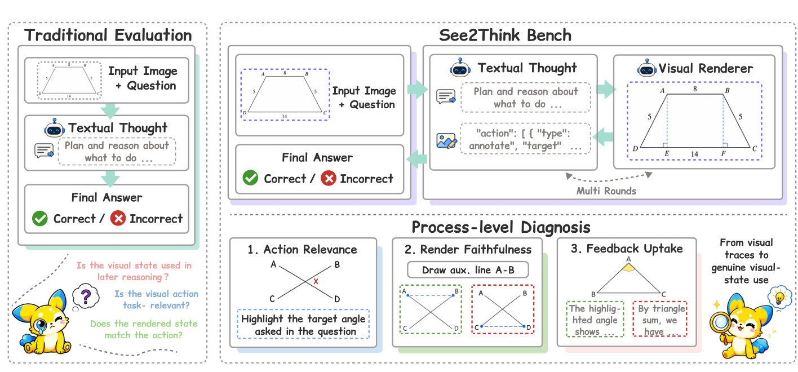
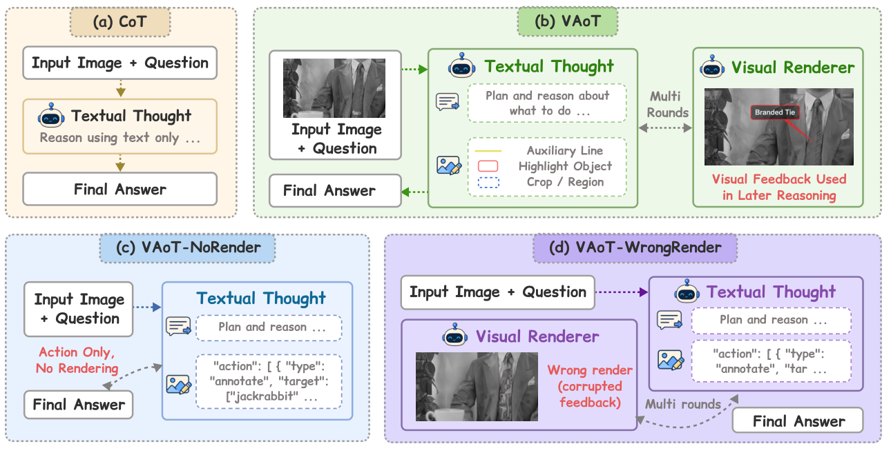

# See2Think: Do Multimodal Models Really Use Intermediate Visual States?

<p align="center">
  Siyu Yan<sup>1,3,†</sup>&nbsp;&nbsp;
  Zhuoran Yan<sup>2,†</sup>&nbsp;&nbsp;
  Haiying Xu<sup>3,4,†</sup>&nbsp;&nbsp;
  Panhao Zhou<sup>2</sup>&nbsp;&nbsp;
  Jingyu Chen<sup>2</sup>&nbsp;&nbsp;
  Chenhao Ji<sup>3</sup>&nbsp;&nbsp;
  Shuo Cao<sup>3,5</sup>&nbsp;&nbsp;
  Yongheng Zhang<sup>2</sup>&nbsp;&nbsp;
  Haoze Liu<sup>3</sup>&nbsp;&nbsp;
  Siyu Zhang<sup>3,6</sup>&nbsp;&nbsp;
  Xiwen Gu<sup>7</sup>&nbsp;&nbsp;
  Yihao Liu<sup>3</sup>&nbsp;&nbsp;
  Alex Jinpeng Wang<sup>2,§</sup>
</p>

<p align="center">
  <sup>1</sup>The Hong Kong University of Science and Technology&nbsp;&nbsp;&nbsp;
  <sup>2</sup>Central South University&nbsp;&nbsp;&nbsp;
  <sup>3</sup>Shanghai AI Laboratory<br>
  <sup>4</sup>The Hong Kong University of Science and Technology (Guangzhou)&nbsp;&nbsp;&nbsp;
  <sup>5</sup>University of Science and Technology of China<br>
  <sup>6</sup>Fudan University&nbsp;&nbsp;&nbsp;
  <sup>7</sup>Wuhan University<br>
  <sup>†</sup>Equal contribution&nbsp;&nbsp;&nbsp;
  <sup>§</sup>Corresponding author
</p>

<p align="center">
  <a href="#"></a>
  <a href="https://csu-jpg.github.io/See2Think/"></a>
  <a href="LICENSE"></a>
  
</p>

<p align="center">
  <a href="https://csu-jpg.github.io/See2Think/">Project Page</a>
</p>

<p align="center">
  
</p>

---

## Overview

**See2Think** is an evaluation framework for testing whether multimodal models genuinely use intermediate visual states during reasoning.

Many recent multimodal systems can draw auxiliary lines, crop regions, highlight objects, or request rendered intermediate images. However, final-answer accuracy alone cannot tell whether the model selected a task-relevant visual action, whether the renderer faithfully executed it, or whether the model used the returned visual state in later reasoning.

See2Think contains two main components:

- **See2ThinkBench:** a 1,200-sample open-ended benchmark across 12 task categories, covering 2D structured reasoning, 3D scene reasoning, and real-world visual reasoning.
- **Visual Action-of-Thought (VAoT):** an inference protocol that records textual thoughts, visual actions, rendered visual states, subsequent reasoning, and final answers.

## Framework

<p align="center">
  
</p>

See2Think evaluates four matched inference settings:

| Setting | Description |
| --- | --- |
| `CoT` | Text-only chain-of-thought baseline. |
| `VAoT-NoRender` | The model proposes visual actions, but no image is rendered back. |
| `VAoT-Full` | The model receives rendered visual states after visual actions. |
| `VAoT-WrongRender` | The model receives task-relevant corrupted visual feedback for diagnostic intervention. |

For VAoT-Full trajectories, See2Think separately evaluates:

| Metric | What it measures |
| --- | --- |
| Action Relevance | Whether the selected visual operation targets task-relevant evidence. |
| Render Faithfulness | Whether the renderer faithfully executes the requested visual action. |
| Feedback Uptake | Whether the model actually uses the rendered visual state in later reasoning. |

WrongRender further tests behavioral dependence by corrupting task-relevant visual feedback while keeping the reasoning model unaware of the corruption.

## Highlights

- **Open-ended benchmark:** 1,200 visually dependent problems across 12 categories.
- **Controlled setting comparison:** CoT, VAoT-NoRender, VAoT-Full, and VAoT-WrongRender are evaluated on matched samples.
- **Process-level diagnosis:** action selection, visual rendering, and feedback use are measured separately from answer accuracy.
- **Corrupted-feedback intervention:** WrongRender probes whether models follow misleading intermediate visual states.
- **Reusable evaluation code:** public entrypoints run inference and answer/process judging without private experiment launchers.

## Results

See2Think reports both final-answer accuracy and process-level behavior. The main analysis is organized around:

| Analysis | Output |
| --- | --- |
| Overall accuracy | Paper-style tables across models, settings, and task groups. |
| Process judging | Action Relevance, Render Faithfulness, and Feedback Uptake summaries. |
| Paired interventions | NoRender → Full render benefit and Full → WrongRender feedback sensitivity. |
| Human audit | Manual validation of process judges and WrongRender quality. |

Full numerical results and qualitative examples are reported in the paper.

## Getting Started

### 1. Clone the repository

```bash
git clone https://github.com/CSU-JPG/See2Think.git
cd See2Think
```

### 2. Install dependencies

```bash
python -m venv .venv
source .venv/bin/activate
pip install -r requirements.txt
```

On Windows PowerShell:

```powershell
python -m venv .venv
.\.venv\Scripts\Activate.ps1
pip install -r requirements.txt
```

### 3. Configure endpoints

Copy the example config and fill in your own endpoints:

```bash
cp config.example.sh config.sh
source config.sh
```

`config.sh` is ignored by git and should never contain committed credentials.

Required variables:

```bash
export SEE2THINK_LLM_BACKEND="openai"      # openai | vllm
export OPENAI_API_KEY="..."
export OPENAI_BASE_URL="..."

export GEMINI_API_KEY="..."
export GEMINI_BASE_URL="..."

export SEE2THINK_DATA_BASE="/path/to/See2Think"
export SEE2THINK_OUTPUT_BASE="/path/to/outputs"
export SEE2THINK_LOG_DIR="/path/to/logs"
```

### 4. Prepare a task manifest

The public repository does not include the paper's full task manifests, benchmark images, or generated model outputs. Provide your own manifest with `--tasks`.

See the minimal format example:

```text
examples/tasks.example.json
```

Each row points to a local benchmark `data.json` file and a sample index within that file.

### 5. Run one setting

```bash
python -u solve/run_tasks.py \
  --tasks /path/to/tasks.json \
  --mode banana \
  --model gpt-5.5 \
  --setting vaot_full \
  --workers 4 \
  --prompt_dir prompt
```

Supported settings:

```text
text_cot
vaot_no_render
vaot_full
vaot_wrong_render
```

## Evaluation

Build answer-judge inputs:

```bash
python eval/build_answer_input.py \
  --tasks /path/to/tasks.json \
  --data-base /path/to/See2Think \
  --manifest /path/to/final_results/_manifest.csv \
  --output-jsonl eval/results/answer_inputs/input.jsonl \
  --model gpt-5.5 \
  --setting vaot_full
```

Run process judging for VAoT-Full:

```bash
python -u eval/process_judge.py \
  --tasks /path/to/tasks.json \
  --results-root /path/to/vaot_full_outputs \
  --model gpt-5.5 \
  --setting vaot_full \
  --judge-model gpt-5.4 \
  --run-name gpt55_vaot_full_process_judge \
  --workers 1
```

## Repository Layout

| Path | Purpose |
| --- | --- |
| `solve/` | Core inference pipeline and VAoT execution. |
| `convert/` | Parsing and answer-evaluation helper code. |
| `eval/` | Answer judging and process-level judging pipeline. |
| `viewer/` | Local trajectory viewer frontend. |
| `prompt/` | Prompt templates for the four inference settings and rendering/intervention steps. |
| `examples/` | Minimal task-manifest examples for public use. |

Large benchmark data, generated trajectories, rendered images, logs, audit packets, and paper output bundles are intentionally excluded from git.

## Citation

If you find See2Think useful, please cite:

```bibtex
@article{yan2026see2think,
  title   = {See2Think: Do Multimodal Models Really Use Intermediate Visual States?},
  author  = {Yan, Siyu and Yan, Zhuoran and Xu, Haiying and Zhou, Panhao and Chen, Jingyu and Ji, Chenhao and Cao, Shuo and Zhang, Yongheng and Liu, Haoze and Zhang, Siyu and Gu, Xiwen and Liu, Yihao and Wang, Alex Jinpeng},
  journal = {arXiv preprint},
  year    = {2026}
}
```

## Acknowledgments

See2Think builds on public benchmark resources across diagrammatic reasoning, 3D scene reasoning, embodied manipulation, and real-world visual reasoning. Please also cite the original benchmark sources when using released See2Think task manifests.
